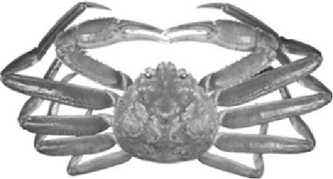

<!--- set up R-environment --->
```{r setup, include=FALSE}
  rmd_dir = getwd()
require(aegis)
  if (0) {
    # To create the msword document from within R run this:
    setwd( file.path( project.codedirectory("SCReports"), "inst", "SAR" ) )  # change to where the rmd file lives
    rmarkdown::render( "snowcrab_sar.rmd", 
      params=list(year.assessment=2021, bio.data.dir=data_root ),  
      output_dir=work_root 
    )
    # system( paste( "/usr/bin/libreoffice -o", file.path( work_root, "snowcrab_sar.docx") ) )
  }

  require(knitr)
  knitr::opts_chunk$set( 
    root.dir = data_root, 
    echo = FALSE, 
    out.width="6.2in", 
    dev.args = list(type = "cairo"), 
    fig.retina = 2, 
    dpi=192
  )
  # knitr::opts_knit$set( root.dir = data_root )  # data_root should be defined in your Rprofile

  year.assessment = params$year.assessment
  year_previous = year.assessment - 1
  year_2019=year.assessment - 2
  p = bio.snowcrab::load.environment( year.assessment=year.assessment )
  SCD = project.datadirectory("bio.snowcrab")

```

```{r echo=FALSE }
  # knitr::opts_chunk$set( root.dir = params$bio.data.dir ) 
  FD = fisherydata_summary()
  
  l_nens = round(FD$landings[which(FD$region=="cfanorth" & FD$yr==year.assessment)])
  l_sens = round(FD$landings[which(FD$region=="cfasouth" & FD$yr==year.assessment)])
  l_4x = round(FD$landings[which(FD$region=="cfa4x" & FD$yr==year.assessment)])
  
  l_nens_p = round(FD$landings[which(FD$region=="cfanorth" & FD$yr==year_previous)])
  l_sens_p = round(FD$landings[which(FD$region=="cfasouth" & FD$yr==year_previous)])
  l_4x_p = round(FD$landings[which(FD$region=="cfa4x" & FD$yr==year_previous)])

  dt_l_nens = round((l_nens - l_nens_p)  / l_nens_p *100 )
  dt_l_sens = round((l_sens - l_sens_p)  / l_sens_p *100 )
  dt_l_4x = round((l_4x - l_4x_p)  / l_4x_p *100 )

  c_nens = round(FD$cpue[which(FD$region=="cfanorth" & FD$yr==year.assessment)])
  c_sens = round(FD$cpue[which(FD$region=="cfasouth" & FD$yr==year.assessment)])
  c_4x = round(FD$cpue[which(FD$region=="cfa4x" & FD$yr==year.assessment)])

  c_nens_p = round(FD$cpue[which(FD$region=="cfanorth" & FD$yr==year_previous)])
  c_sens_p = round(FD$cpue[which(FD$region=="cfasouth" & FD$yr==year_previous)])
  c_4x_p = round(FD$cpue[which(FD$region=="cfa4x" & FD$yr==year_previous)])

  dt_c_nens = round(( c_nens - c_nens_p ) /c_nens_p * 100 )
  dt_c_sens = round(( c_sens - c_sens_p ) /c_sens_p * 100 )
  dt_c_4x = round(( c_4x - c_4x_p ) /c_4x_p * 100 )

  dt = as.data.frame( FD[ which(FD$yr %in% c(year.assessment - c(0:10))),] )
  n = ( which(dt$region=="cfanorth") )
  s = ( which(dt$region=="cfasouth") )
  x = ( which(dt$region=="cfa4x") )
  dt =  dt[,c("yr", "Licenses", "TAC", "landings", "effort", "cpue")] 
  names(dt) = c("Year", "Licenses", "TAC", "Landings", "Effort", "CPUE") 
  rownames(dt) = NULL
  
  tac_nens = FD$TAC[which(FD$yr==year.assessment & FD$region=="cfanorth")]
  tac_sens = FD$TAC[which(FD$yr==year.assessment & FD$region=="cfasouth")]
  tac_4x = FD$TAC[which(FD$yr==year.assessment & FD$region=="cfa4x")] # 4x is refered by start year
  tac_4x_p = FD$TAC[which(FD$yr==year_previous & FD$region=="cfa4x")] # 4x is refered by start year


  # carapace condition .. could have used the stuff in 02_fisures and table but it was convoluted
  # should replace that mess with this eventually 
  male = 0
  odb = observer.db("odb")
  setDT(odb)
  odb = odb[ which( odb$sex==male & odb$cw >= 44 & odb$cw < 170 & odb$prodcd_id=="0" & is.finite(odb$shell) ) ,]  # commerical sized crab only
  odb$region = NA
  for ( reg in c("cfanorth", "cfasouth", "cfa4x")) {
    r = polygon_inside(x=odb, region=aegis.polygons::polygon_internal_code(reg), planar=FALSE)
    if (length(r)> 0)  odb$region[r] = reg
  }
  CC = odb[ !is.na(odb$region), .N, by=.(region, fishyr, shell) ]
  CC[, total:=sum(N, na.rm=TRUE), by=.(region, fishyr)]
  CC$percent = round(CC$N / CC$total, 2) * 100
  cc_soft_nens = CC[region=="cfanorth" & fishyr==year.assessment & shell %in% c(1,2), sum(percent)]
  cc_soft_sens = CC[region=="cfasouth" & fishyr==year.assessment & shell %in% c(1,2), sum(percent)]
  cc_soft_4x = CC[region=="cfa4x" & fishyr==year.assessment & shell %in% c(1,2), sum(percent)]
  cc_soft_nens_p = CC[region=="cfanorth" & fishyr==year_previous & shell %in% c(1,2), sum(percent)]
  cc_soft_sens_p = CC[region=="cfasouth" & fishyr==year_previous & shell %in% c(1,2), sum(percent)]
  cc_soft_4x_p = CC[region=="cfa4x" & fishyr==year_previous & shell %in% c(1,2), sum(percent)]

```


# ASSESSMENT OF Scotian Shelf Snow Crab

| <!-- -->    | <!-- -->    |
|:--------------------------------------: |:--------------------------------------------------- |
| {width=240} | {width=320} |
| *Snow Crab (Chionoecetes opilio)*  | *Figure 1. Map of the Scotian Shelf and Crab  Fishing Areas (CFAs). Original figure in colour.*  |

| **Context:**     |  
|:--- | 
| *Snow Crab (Chionoecetes opilio, O. Fabricius) have been a dominant macro-invertebrate in the Scotian Shelf Ecosystem (SSE) since the decline of the groundfish. They are observed in large numbers in deep, soft-bottom substrates ranging from 60 to 280 m and at temperatures generally less than 6°C. The SSE Snow Crab are in the southern-most extreme of their spatial distribution in the Northwest Atlantic.*  \
*The fishery has been in existence since the early 1970s in Nova Scotia. The management of the Snow Crab fisheries in the SSE was initially based on effort controls (season, license, trap limits) from 1982 to 1993 with harvesting during June-November of hard-shelled males larger than 95 mm Carapace Width. Additional management measures were introduced from 1994 to 1999: individual boat quotas, Total Allowable Catches (TACs), 100% dockside monitoring, mandatory logbooks and at-sea monitoring by certified observers. In 2005, many Crab Fishing Areas (CFAs) and subareas were merged with the resulting divisions being North-Eastern Nova Scotia (N-ENS) (CFAs 20-22), South-Eastern Nova Scotia (S-ENS) (CFAs 23, 24), and 4X (Figure 1). Spring fishing efforts in N-ENS and S-ENS now represent a large portion of overall landings. There was no survey conducted in 2020 due to COVID-19 restrictions, as well as reduced At-Sea-Observer coverage in 2020 and 2021.* \
*In support of the fishery, Fisheries and Oceans Canada (DFO) Maritimes Fisheries Management requests from DFO Science an annual assessment of resource status. An assessment of the status of 4VWX Snow Crab is based on fishery independent surveys using indicators of abundance, reproductive potential, recruitment, and  exploitation rates. Ecosystem and environmental indicators are also incorporated into the assessment. Commercial catch  rates and other fishery statistics are reported.* \
*This Science Advisory Report is from the regional Science Response Process on the Stock Status Update of Scotian Shelf Snow crab, held February 24, 2022. Additional  publications from this process will be posted on the  [*[Fisheries and Oceans Canada (DFO) Science Advisory  Schedule]{.ul}*](http://www.isdm-gdsi.gc.ca/csas-sccs/applications/events-evenements/index-eng.asp) as they become available.* |
| <!-- -->    |  


## SUMMARY

- Landings (t) in `r year.assessment` were `r l_nens` in N-ENS, `r l_sens` in S-ENS and `r l_4x` in CFA 4X, respectively, representing a change of `r dt_l_nens` %, `r dt_l_sens` % and `r dt_l_4x` % (incomplete season), respectively, relative to `r year_previous`. Total Allowable Catches (TAC) were `r tac_nens` t, `r tac_sens` t and `r tac_4x` t, respectively. 

- Non-standardized catch rates (kg/trap haul) in `r year.assessment` were `r c_nens` in N-ENS, `r c_sens` in S-ENS and `r c_4x` in CFA 4X. Relative to `r year_previous`, this represents a change of `r dt_c_nens`%, `r dt_c_sens`% and `r dt_c_4x`% (incomplete season).

- Commercial catches of soft-shelled (newly moulted) Snow Crab were `r cc_soft_nens`% in N-ENS, `r cc_soft_sens`% in S ENS and `r cc_soft_4x`% in CFA 4X (incomplete season) for `r year.assessment`. In `r year_previous`, it was `r cc_soft_nens_p`%, `r cc_soft_sens_p`% and `r cc_soft_4x_p`%, respectively. Higher soft-shell handling results in higher unnecessary mortality.

- The modelled, post-fishery, fishable biomass of Snow Crab in N-ENS was estimated to be 4,460 t, relative to 3,299 t in `r year_previous`. In S-ENS, the post-fishery, fishable biomass index was 54,408 t, relative to 44,705 t in `r year_previous`. In 4X, the fishable biomass was 418 t, relative to 428 t in `r year_previous`.

- Substantial recruitment of female Snow Crab into the mature (egg-bearing) segment of the population occurred from 2016-2018 and egg/larval production is expected to be high, though decreasing, as the numeric densities of mature female Snow Crab are now declining.

- Bycatch of non-target species is extremely low (<0.4%) in all Snow Crab fishing areas. 

- Based on stomach sampling, Atlantic Halibut, Atlantic Wolffish, Thorny Skate, and other skate species appear to be the predominant predators of Snow Crab on the Scotian Shelf. Increased Halibut biomass lowers both the abundance and reproductive potential of Snow Crab on the Scotian Shelf.
 
- In N-ENS, minor TAC decreases for the past two seasons and increased recruitment to the fishery have helped catch rates and fishable biomass estimates to rebound. N-ENS has moved from the cautious zone in `r year_previous` to the healthy zone in `r year.assessment`. Given stock status and incoming recruitment, catch levels similar to those in 2017 and 2018 would help to maintain recent exploitation levels.

- In S-ENS, substantial TAC reductions from 2016-2018 helped maintain stable fishery performance (catch rates) in spite of reduced recruitment, increased predation, and falling fishable biomass estimates throughout that time. Increased recruitment to the fishery is likely for the upcoming season. Exploitation rates derived from the fishery model have been declining in recent years. An increase in catch levels would help to maintain recent exploitation levels.

- 4X is the southern-most extent of Snow Crab distribution in the North Atlantic. Snow Crab behavior and distribution in 4X is affected by increased volatility of ecosystem pressures such as water temperature, predation, and bycatch in other fisheries. Due to a lack of coherence in inter-annual size-frequency distributions, the current Harvest Control Rules and associated management practices (ultimately based on survey results) for 4X should be revisited. Alternate harvest strategies will be explored before the upcoming fall season.


## BACKGROUND

### Species Biology

Snow Crab (*Chionoecetes opilio*, O. Fabricius) is a subarctic species with a distribution from northern Labrador to near the Gulf of Maine. Habitat preference is for soft mud bottoms. Smaller crabs are found in more complex habitats with shelter. Commercial sized crab (male, \>95 mm Carapace Width (CW)) in large numbers are found at depths from 60 to 280 m and temperatures from -1 to 6°C in the Scotian Shelf Ecosystem (SSE). Temperatures greater than 7°C are known to be detrimental to Snow Crab. The primary food items of Snow Crab are shrimp, fish (Capelin and Lumpfish), starfish, sea urchins, worms, detritus, large zooplankton, other crabs, molluscs, sea snails, and sea anemones. Predators of Snow Crab are Atlantic Halibut, skates (especially Thorny Skate), Atlantic Cod, seals, American Plaice, squids, and other crabs. Crab in the size range of 3 to 30 mm CW are particularly vulnerable to predation, as are soft-shelled crab in the spring moulting season. Snow Crab have been a dominant macro-invertebrate in the SSE since the decline of groundfish abundance during the late 1980s and early 1990s. The SSE Snow Crab are in the southern-most extreme of their spatial distribution in the northwest Atlantic and, as such, are one of the Snow Crab populations most susceptible to increasing ocean temperatures.

### Fishery

The Snow Crab fishery in eastern Canada began in 1960 with incidental bycatches by groundfish draggers near Gaspé, Quebec. Its development was slow until the 1980s, when it began expanding rapidly to become one of the largest fisheries in Canada in terms of landings and landed value. On the Scotian Shelf, the fishery has been in existence since the early 1970s. The Scotian Shelf Snow Crab fishery lands only males with CW ≥ 95 mm. There is also a concerted effort to avoid areas of newly moulted (soft-shelled) crab and to discard immature males. The North-Eastern Nova Scotia (N-ENS) and South-Eastern Nova Scotia (S- ENS) fisheries are conducted within a calendar year. The 4X fishery is conducted over a fall to winter fishing season spanning calendar years. Total landings increased to record-levels of approximately 10,000 tonnes (t) each year in the early 2000s and increased further to approximately 14,000 t in 2010 (Figure 2). In 2005, many Crab Fishing Areas (CFAs) and subareas were merged, with the resulting divisions being N-ENS (formerly CFAs 20-22), S-ENS (CFAs 23 and 24), and 4X (Figure 1).

Fishery catch rates are biased indicators of Snow Crab abundance. This is because spatial and temporal distribution of Snow Crab and fishing effort are not the same. In particular, catch rates depend upon seasonality, bottom temperatures, food availability, reproductive behavior, substrate/shelter availability, relative occurrence of soft and immature crab, species composition, fisher experience, bait type, soak time, and ambient currents. Catch rates have not been adjusted for these influences. As such, catch rates are used primarily as a measure of fishery performance. 

Landings in `r year.assessment` were `r l_nens` t in for N-ENS, `r l_sens` t in S-ENS and `r l_4x` t in CFA 4X (incomplete season), representing a change of `r dt_l_nens`%, `r dt_l_sens`% and  `r dt_l_4x`% (incomplete season), respectively, relative to `r year_previous` (Figure 2, Tables 1-3). Total Allowable Catches for `r year.assessment` were `r tac_nens` t, `r tac_sens` t and `r tac_4x` t in N-ENS, S-ENS and 4X, respectively. 

</br>


```{r echo=FALSE }
  fisherydata_summary( FD=FD, toget="timeseries_landings" ) 
```

*Figure 2. Temporal variations in the landings (t) of Snow Crab on the Scotian Shelf. The landings follow the Total Allowable Catches (TACs) with little deviation, so the TACs are not shown. For 4X, the year refers to the starting year of the season. For N-ENS and 4X, the values are multiplied by 5 to be on a comparable scale.*

</br>

*Table 1. Summary of the Snow Crab fishery in North-Eastern Nova Scotia. The units for TAC and Landings are  tons; for CPUE, kg/ht; and for Effort 1000 trap hauls.* 
```{r fishery_table_nens, echo=FALSE }
kable(dt[n,], format="simple", row.names=FALSE, align="ccccc" ) 
```

</br>

*Table 2. Summary of the Snow Crab fishery in South-Eastern Nova Scotia. The units for TAC and Landings are  tons; for CPUE, kg/ht; and for Effort 1000 trap hauls.*
```{r fishery_table_sens, echo=FALSE }
kable(dt[s,], format="simple", row.names=FALSE, align="ccccc" )
```

</br>

*Table 3. Summary of the Snow Crab fishery in North-Eastern Nova Scotia. The units for TAC and Landings are  tons; for CPUE, kg/ht; and for Effort 1000 trap hauls. There were no landings or TACs in 2018/2019 due multiple indications of low abundance.*
```{r fishery_table_4x, echo=FALSE }
kable(dt[x,], format="simple", row.names=FALSE, align="ccccc" )
```

</br>

This needs updating: 
{
*In 2019, the majority of N-ENS landings came almost exclusively from the inner grounds, not the Glace Bay Hole (Figure 1). In S-ENS, a general offshore shift of landings was observed from the 2018 season (Map 1). There were no landings on the continental slope areas of S-ENS in 2019.* 
}

Non-standardized catch rates in `r year.assessment` were `r c_nens` kg/trap haul in N-ENS and `r c_sens` kg/trap haul in S‑ENS. This represents a change of `r dt_c_nens` % (N-ENS) and `r dt_c_sens` % (S-ENS) relative to the previous year (Tables 1-3, Figure 3, Map 2). The effect of TACs on catch rates can confound direct comparison over time and between management areas.


```{r echo=FALSE }
  fisherydata_summary( FD=FD, toget="timeseries_cpue" ) 
```

*Figure 3. Temporal variations in catch rates of Snow Crab on the Scotian Shelf, expressed as kg per trap haul. Trap design and size have changed over time. No corrections have been made for variation in trap-types, soak time, or bait-type.*

</br>

Carapace Condition (CC) defines the approximate age (since terminal moult) of the terminally moulted crab based on the relative development and subsequent decay of the carapace. CC1 signifies a newly moulted crab, soft-shelled, with no epibiont (e.g., barnacles) growth. CC2 has begun to harden, but is still considered to be soft and of no commercial value. CC3 and CC4 represent ideal commercial crab. The oldest carapace condition (CC5) signifies extensive shell decay with no expectation of survival into the next year.

- Commercial catches of soft-shelled (newly moulted) Snow Crab were `r cc_soft_nens`% in N-ENS, `r cc_soft_sens`% in S ENS and `r cc_soft_4x`% in CFA 4X (incomplete season) for `r year.assessment`. In `r year_previous`, it was `r cc_soft_nens_p`%, `r cc_soft_sens_p`% and `r cc_soft_4x_p`%, respectively. Higher soft-shell handling results in higher unnecessary mortality.

 <!--  
2021 results:

-->

To update {
>In N-ENS, CC1 and CC2 crab represented `r cc_soft_nens`% of the observed catch, relative to `r cc_soft_nens_p`% in `r year_previous` (Figure 4).  CC5 levels remain negligible. In S-ENS, the occurrence of CC1 and CC2 crab was `r cc_soft_sens`% relative to `r cc_soft_sens_p`% in `r year_previous` (Figure 4).Senescent (CC5) crab represented less than 1% of the total observed catch and survey catches in all areas.

>In N-ENS, the estimated soft-shell crab discard rate (percentage of total landings as determined by at-sea observer sampling) was 5% in 2019, a decrease from 25% in 2018 (the highest level in 10 years). In S-ENS, the 2019 estimated soft-shell discards were 2% of landings, and is consistent with the 2018 estimate. Soft-shelled discards are generally negligible in 4X, due to season timing. Maximizing spring fishing efforts will limit this source of Snow Crab mortality, that is incidental to the fishery removals.
}

```{r, out.width=280 }
  loc = file.path( SCD, "assessments", year.assessment, "figures", "size.freq", "observer")
  fn1 = file.path( loc, paste( "size.freqcfanorth", (year_previous), ".pdf", sep="" ) )
  fn2 = file.path( loc, paste( "size.freqcfanorth", (year.assessment  ), ".pdf", sep="" ) )
  fn3 = file.path( loc, paste( "size.freqcfasouth", (year_previous), ".pdf", sep="" ) )
  fn4 = file.path( loc, paste( "size.freqcfasouth", (year.assessment  ), ".pdf", sep="" ) )
  fn5 = file.path( loc, paste( "size.freqcfa4x", (year_previous), ".pdf", sep="" ) )
  fn6 = file.path( loc, paste( "size.freqcfa4x", (year.assessment  ), ".pdf", sep="" ) )
  include_graphics(  c(fn1, fn2, fn3, fn4, fn5, fn6) )
```

*Figure 4. Size frequency distribution of Snow Crab sampled by at-sea observers, broken down by Carapace Condition (CC). For 4X, the year refers to the starting year of the season; the current season is ongoing. Vertical lines indicate 95 mm Carapace Width, the minimum legal commercial size.*
\

## ASSESSMENT

### Stock Trends and Current Status

#### Fishable Biomass 
 <!--  
2021 results:
>       # densities of biomass estimates for the year.assessment
>       ( qs = apply(  res$mcmc$B[,NN,], 2, quantile, probs=c(0.025, 0.5, 0.975) ) )
         [,1]     [,2]       [,3]
2.5%  1.65790  4.72276 -0.0578404
50%   2.84379 14.53740  0.1678450
97.5% 4.20638 36.54831  0.4958738

>    # densities of biomass estimates for the previous year
>       ( qs = apply(  res$mcmc$B[,NN-1,], 2, quantile, probs=c(0.025, 0.5, 0.975) ) )
         [,1]    [,2]     [,3]
2.5%  2.64461 22.4698 0.136532
50%   3.82027 34.8777 0.400803
97.5% 6.03634 58.8165 0.718886

-->

The fishable biomass (Figure 5, Map 3) is defined as snow crab that are male, mature, and larger than 95 mm CW. Geometric mean fishable biomass density is shown in Figure 5 (Map 3). Estimation of a fishable biomass index was conducted using using conditional auto-regressive spatio-temporal models (Choi 2020). This approach models snow crab numerical abundance and mean size with environmental (depth, substrate, temperature) and biological factors (species composition) as covariates to estimate biomass. This index is coupled with a logistic population dynamics model (*fishery model*) to determine fishable biomass and relevant biological reference points (i.e., carrying capacity and fishing mortality at maximum sustainable yield, or F~MSY~) associated with the harvest control rules of the Snow Crab fishery.

```{r, out.width=480 }
  include_graphics( file.path( SCD, "assessments", year.assessment, "timeseries", "survey", "R0.mass.pdf") )
```

*Figure 5. The crude, geometric mean fishable biomass density ($t/km^2$) from the Snow Crab survey. Error bars represent 95% Confidence Intervals around the geometric mean.*
\

The modelled, post-fishery, fishable biomass (Figure 6) of Snow Crab in `r year.assessment` for N-ENS was estimated to be 4,460 t, relative to 3,299 t in `r year_previous`. In S-ENS, the post‑fishery, fishable biomass was 54,408 t, relative to 44,705 t in `r year_previous`. In 4X, the `r year.assessment` pre‑fishery, fishable biomass was 418 t, relative to 428 t in `r year_previous`. The 4X biomass estimate is generally more uncertain as Snow Crab behavior and distribution in this area appear to be more affected by an increased volatility of ecosystem pressures such as water temperature, predation and bycatch in other fisheries. 


```{r, out.width=480 }
  #loc = file.path( file.path( SCD, "modelled", "1999_present", "fishery_model_results" ) )
  #fn = file.path( loc, "biomass.timeseries.png" )
  #include_graphics( fn )
```

*Figure 6. Time series of fishable biomass. The fishable biomass index is shown in red dashed lines. The q-corrected (model catchability coefficient), fishable biomass index is shown in green dashed lines. Posterior mean fishable biomass estimates from the logistic model are shown in blue stippled lines. Density distribution of posterior fishable biomass estimates are presented with 95% Confidence Interval (grey).*
\


#### Fishable Recruitment 

Quantitative determination of recruitment levels into the fishable biomass is confounded by a number of factors. These include terminal moult (the timing offset of moulting in spring and the survey in the fall), the inability to age crab, and the inability to predict the age that male crab will terminally moult. Based on size-frequency histograms of the male Snow Crab population, moderate internal recruitment (from within the same fishing area) to the fishery is expected for the next year in N-ENS and S-ENS (Figure 7). Internal recruitment in 4X for the next year is expected to be minimal. Immigration of crab from outside a given area can represent recruitment to its fishery. This type of recruitment is unreliable due to the episodic nature of immigration. Erratic temperature fields in 4X create strong uncertainties for future recruitment.

In the survey, the presence of small, immature, male Snow Crab in N-ENS and S-ENS (Figure 7), spanning almost all size ranges (30-95 mm CW), suggests that internal recruitment to the fishery is probable for the next 3-4 years, though potentially at decreasing rates due to the lower numeric densities of smaller animals. High numerical densities at the smallest size range (\< 30mm), in all areas, are a promising sign of potential long-term recruitment. The survival of small crab is essential for the fishery to realize this recruitment. Any mortality (e.g. predation, environmental, and disease), emigration, or sub-legal-size terminal moulting will impact this recruitment potential. Based on size-frequency distributions from the trawl survey, 4X shows limited potential for internal recruitment to the fishery for the next 2-3 years.

#### Reproduction

In all areas, there was substantial recruitment of female crab into the mature (egg-bearing) segment of the population from 2016-2018 (Figure 8) and egg/larval production is expected to be high, though decreasing as the numeric densities of mature female crab are now declining. This decline in mature females, coupled with increased male maturation, produces a declining mature sex ratio (proportion of mature female to male crab; Figure 9) since 2017 in N‑ENS and S-ENS. In 4X, mature sex ratios are more stable in the same time frame. Based on population size structure, mature female abundance is expected to decline for the next 3-4 years in all areas.


```{r }
  loc = file.path( SCD, "assessments", year.assessment, "figures", "size.freq", "survey")
  fn1 = file.path( loc,  "male.pdf" )
  include_graphics(  fn1  )
```

*Figure 7. Size-frequency histograms of carapace width of male Snow Crab. This figure provides information about the relative numbers within a given year. The vertical line represents the legal size (95 mm). Immature animals are shown with light coloured bars, mature with dark.*  
\

```{r }
  loc = file.path( SCD, "assessments", year.assessment, "figures", "size.freq", "survey")
  fn1 = file.path( loc,  "female.pdf" )
  include_graphics(  fn1  )
```

*Figure 8. Size-frequency histograms of carapace width of female Snow Crab. This figure provides information about the relative numbers within a given year. Immature animals are shown with light coloured bars, mature with dark.*
\

```{r, out.width=480 }
  include_graphics( file.path( SCD, "assessments", year.assessment, "timeseries", "survey", "sexratio.mat.pdf") )
```

*Figure 9. Sex ratios (proportion female) of mature Snow Crab. The Scotian Shelf is generally male dominated. Dashed line shows equal proportions. Solid grey line represents the long-term mean.*
\

#### Fishing Mortality
 <!--  
2021 results:
>   # densities of F in assessment year
>       ( qs = apply(  res$mcmc$F[,NN,], 2, quantile, probs=c(0.025, 0.5, 0.975) ) )
          [,1]     [,2]      [,3]
2.5%  0.194258 0.205049  0.188788
50%   0.275465 0.452458  0.478635
97.5% 0.434372 1.015674 13.815500

>       ( qs = apply(  res$mcmc$F[,NN,], 2, mean ) )
[1] 0.293375 0.534447 1.728222

  # densities of F in previous year
>       ( qs = apply(  res$mcmc$F[,NN-1,], 2, quantile, probs=c(0.025, 0.5, 0.975) ) )
          [,1]     [,2]     [,3]
2.5%  0.129478 0.126699 0.100604
50%   0.197556 0.205212 0.173814
97.5% 0.274232 0.302745 0.442938
>       ( qs = apply(  res$mcmc$F[,NN-1,], 2, mean ) )
[1] 0.194404 0.209676 0.227958
exploitationrate_fishingmortality = function(er=NULL, fm=NULL) {
+     
+     
+     
+     if (is.null(fm)) return( -log(1-er) )
+     if (is.null(er)) return( 1-exp(-fm) )
+ }

-->

The `r year.assessment` N-ENS fishing mortality (F) is estimated to have been 0.14 (exploitation rate 0.13), a decrease from 0.22 in `r year_previous` (Figure 10). 

The `r year.assessment` S-ENS fishing mortality (F) is estimated to have been 0.12 (exploitation rate 0.13), a decrease from 0.13 in `r year_previous` (Figure 10). Localized exploitation rates are likely higher, as not all areas where biomass estimates are provided are fished (e.g., continental slope areas and western, inshore areas of CFA 24).

The 4X fishing mortality (F) in `r year_previous`/`r year.assessment` was XX (Figure 10). Generally, in 4X realized exploitation rates are likely higher, since the computed exploitation rates incorporate biomass from throughout the 4X area and not just the fishery grounds.

```{r, out.width=480 }
  #include_graphics( file.path( SCD, "modelled", "1999_present", "fishery_model_results", "fishingmortality.timeseries.png" ) )
```

*Figure 10. Time-series of fishing mortality from the fishery model for N-ENS, S-ENS, and 4X, respectively. Posterior density distributions are presented in gray, with the darkest line being the median with  95% Confidence Interval shading. The solid(red) line is the estimated fishing mortality at maximum sustainable yield and the stippled (black) line is the 20% harvest rate.*
\

```{r, out.width=480 }
 # include_graphics( file.path( SCD, "assessments", year.assessment, "timeseries", "temperature_bottom.pdf") )
```

*Figure 11. Annual variations in bottom temperature observed in September.*
\

### Ecosystem Considerations

#### Environmental Variability

To update {
>Average bottom temperatures in the 2019 Snow Crab survey were near the long-term median in all areas (Figure 11). A general warming trend has been observed since the early 1990s on the Scotian Shelf. Temperatures are more stable in N-ENS than S-ENS; 4X exhibits the most erratic annual mean bottom temperatures.
}

#### Predation

Based on stomach sampling, Atlantic Halibut (Figure 12; DFO 2018), Atlantic Wolffish, Thorny Skate (Figure 13), and other skate species are predators of Snow Crab. Localized predation rates may be much higher due to relative local abundance and encounter rates.

Atlantic Halibut biomass has increased rapidly since 2010 (Figure 12; DFO 2018); consequently, the total number of Snow Crab consumed by Halibut is expected to increase. Large Atlantic Halibut with mature female Snow Crab in their stomachs have been reported. 

Increasing predation lowers both the abundance and reproductive potential of Snow Crab on the Scotian Shelf. 


```{r, out.width=480 }
  fn = file.path( SCD, "assessments", year.assessment, "timeseries", "survey", "ms.mass.30.pdf")
  if ( file.exists(fn) ) {
    include_graphics( fn )
  } else {
    warning( fn, "was not found" )
  }
```
 
*Figure 12. Atlantic Halibut biomass for the Scotian Shelf and Southern Grand Banks from the Halibut stock assessment model (black lines) and the Halibut survey (blue circles). The solid black line is total biomass, the dashed line is legal biomass, and the dotted line is spawning stock biomass. The solid red bar is the current 3-year mean of the Halibut survey biomass index.*

```{r, out.width=480 }
  fn = file.path( SCD, "assessments", year.assessment, "timeseries", "survey", "ms.mass.201.pdf")
  if ( file.exists(fn) ) {
    include_graphics( fn )
  } else {
    warning( fn, "was not found" )
  }

```
 
*Figure 13. Thorny Skate biomass trend from annual Snow Crab survey. Horizontal lines indicate the long-term median within each  subarea. Error bars are 95% Confidence Intervals estimated by bootstrapping.*   


#### Human Influences

>Oil and gas development/exploitation continues to occur on the Scotian Shelf near, or upstream from, major crab fishing grounds and population centres in both N-ENS and S-ENS. The effects of seismic methods of exploration upon potentially vulnerable components of the Snow Crab population (eggs, larvae, soft-shelled crab) and the long-term biological effects of development upon this long-lived species remain unknown (DFO 2004; Boudreau et al. 2009; Courtenay et al. 2009). Future seismic work has been proposed throughout the Scotian Shelf in 2020-2021 (CNSOPB 2019).

>Undersea cables have been identified by fishers as another source of concern, in particular, the Emera Maritime Link subsea electricity cables spanning approximately 180 km from Cape Ray, Newfoundland to Point Aconi, Nova Scotia. At present, there is no information that can be presented to definitively describe their effects upon Snow Crab.

>St. Anns Bank was designated as a Marine Protected Area (MPA) in 2017 (Canada Gazette 2016). The presence of a refuge from fishing activities is potentially positive as it could serve as a fallow area. However, if the reserve is disproportionately beneficial to other organisms, either predators or prey of Snow Crab, the effects upon Snow Crab could be mixed. The long-term effects of the MPA cannot be determined at this point.

#### Bycatch and Incidental Catch

>Bycatch levels in the SSE Snow Crab fishery have been extremely low over the long term. Estimates of bycatch in this fishery are extrapolated from at-sea observer estimates. For the years 2016, 2017, and 2019, the cumulative bycatch in N-ENS and S-ENS was \<0.02% of landings. No species-specific estimates were available for 2018 due to improper sampling protocol adherence. In 4X, 2015-2017 bycatch represented 0.03% of total snow crab landings. There was no 4X fishery for the 2018/19 season, . The majority of bycatch for all areas is composed of other invertebrate species (e.g. Northern Stone Crab, Jonah Crab and American Lobster) for which higher survival rates can be expected after being released as compared to finfish discards. In previous years, at-sea observers reported two Leatherback Sea Turtles as having been entangled in buoy lines. Both were released alive, though bleeding. A Humpback Whale was entangled in buoy lines in 2012, which was released with little or no harm to the animal. Multiple entanglements of North Atlantic Right Whales in a neighbouring Snow Crab area (CFA 12) during the summers of 2017 and 2019 has increased vigilance and modified management measures within Snow Crab fisheries in the SSE to minimize the potential for marine mammal interactions with Snow Crab fishing gear.

>Mortality of Snow Crab from other fisheries is still not quantified. Trawls can increase mortality, especially upon the soft-shelled phases of Snow Crab. The lack of trawl fisheries (other than shrimp trawling), in the majority of Snow Crab habitat on the Scotian Shelf, limits this potential damage. Additional effort of high bottom contact fisheries (such as dredging) could negatively impact Snow Crab habitat. The temporal and spatial overlap of Snow Crab and Lobster populations in 4X introduce a potential source of increased mortality or animal stress. The Lobster fishery in 4X (Lobster Fishing Areas 33-34) is active for 6 months of the year with hundreds of participants.

> Bottom damage from the placement of Snow Crab traps is thought to be minimal.

### Sources of Uncertainty

Snow crab being cold water stenotherms, environmental variability is critical for their survival. The Maritimes Region being at the confluence of many oceanic currents renders the area highly variable. Rapid climate change exacerbates this situation.

Being long-lived, the influence of predators can be significant. Especially important are predators of the smaller immature and female snow crab. Some of these predators have increased in abundance in the Region. 

Capture of soft-shell Snow Crab is a concern as handling them represents a source of mortality of the fraction of a population that is on the verge of recruitment in the fishable biomass; mortality that can be avoided. This depends upon annual variations in recruitment and time of year they are fished. An earlier season in N-ENS and S-ENS has significantly reduced soft-shell handling ad presumably associated mortality. Prompt and careful return of immature (small-clawed, non-terminally moulted) crab to the water is an important conservation measure that will enhance the 2-3 year productivity.

Illegal, unreported, and unregulated fishing activities are known to occur. Such activities hinder the application of a precautionary approach to the management of this resource. 

The fishing industry see the impact of seismic exploration, cable trenching and installation and similar large scale activities as a perturbation upon Snow Crab productivity by causing mortality.

To remain adaptive in the face of these and other as yet unknown uncertainties is the challenge. The precautionary approach represents a measured means of maintaining this adaptive capacity. 


## CONCLUSIONS AND ADVICE

A reference points-based Precautionary Approach has been implemented in this fishery. The Lower Reference Point (LRP) and Upper Stock Reference (USR) are 25% and 50% of carrying capacity, respectively. The Target Removal Reference is 20% of the fishable biomass in each area and the Removal Reference (RR) is to exploit at levels below fishing mortality at Maximum Sustainable Yield (FMSY). Various secondary indicators (population and ecosystem) are taken into consideration for management decisions (Figure 14). 

### North-Eastern Nova Scotia (N-ENS)

Large male snow crab must be protected to maintain habitat space and the breeding capacity of the stock. A gap in future recruitment to the fishery is expected in 3-4 years based on the size structure of the N-ENS snow crab population. Both of these factors support conservative harvest strategies. Minor TAC decreases for the past two seasons and increased recruitment to the fishery have helped fishable biomass estimates to rebound. N-ENS has moved from the cautious zone in 2018 to the healthy zone in 2019. Given stock status and incoming recruitment, catch levels similar to those in 2017 and 2018 would help to maintain recent exploitation levels.

### South-Eastern Nova Scotia (S-ENS)

The exemplary, precautionary harvest strategies adopted by the S-ENS fishery appear to have increased stability in commercial biomass levels. This stability is an important consideration given the changing ecosystems and the more volatile state of global Snow Crab populations. This stock remains in the healthy zone.Substantial TAC reductions from 2016-2018 helped maintain stable fishery performance (catch rates) in spite of reduced recruitment, increased predation, and falling fishable biomass estimates throughout that time. Increased recruitment to the fishery is likely for the upcoming season. Exploitation rates derived from the fishery model have been declining in recent years. An increase in catch levels would help to maintain recent exploitation levels.

### 4X

CFA 4X is the southern-most extent of Snow Crab distribution in the North Atlantic, existing in more variable  habitats relative to the other areas of S-ENS and N-ENS (water temperature, predation).  ... To be completed ...


## MANAGEMENT CONSIDERATIONS
 
### Precautionary Approach

Many existing measures and fishing practices in the Scotian Shelf Snow Crab fishery are inherently precautionary: 

- No removal of female crab. Reproductive potential of spawning stock biomass is not disrupted. Most removals of males occur after mating and sub-legal mature crab (able to reproduce) are never removed.

- Conservative exploitation strategies have generally been the norm, especially in recent years.

- Spatial and temporal refugia from directed fishing pressures exist in MPAs, along the continental slope, and much of the western inshore portion of CFA 24 and with fishing seasons.

- Immature and soft-shelled (newly-moulted, easily damaged) Snow Crab are not harvested, and handling mortality is minimized via spring harvesting, voluntary area closures, and at-sea observer monitoring of soft-shell incidence, helping to maximize the potential yield per animal to the biomass. 

In addition to the above, **Harvest control rules** are used to guide harvest strategies (DFO 2013; Figures 14 & 15). More specifically, the state of the fishery relative to the following "reference points" are used to determine overall strategy. In terms of fishable biomass, Lower and Upper Stock Reference (LSR, USR) are 25% and 50% of carrying capacity delineate "critical", "cautious" and "healthy" zones. In terms of exploitation rates, the Removal Reference (RR) is exploitation rate that we try not to cross; it is defined in terms of the fishing mortality associated with Maximum Sustainable Yield (FMSY).    

The operational Target Removal Reference (TRR) changes depending upon the "zone" in which a lands. When in the "healthy zone", the TRR is between 10% to 30% of the fishable biomass (or fishing mortality of 0.11 and 0.36, respectively). In the "cautious zone",  the TRR is between 0% to 20% of the fishable biomass (or fishing mortality of 0 and 0.22, respectively). In the "critical zone", fishery closure until recovery (at a minimum, until FB > LSR). Overall biological and ecosystem (secondary) considerations as recruitment, spawning stock (female) biomass, size structure, sex ratios and environmental and ecosystem conditions, provide additional guidance within each range.
\

```{r, out.width=480 }
  loc = file.path( project.codedirectory("SCReports"), "inst", "SAR", "media" )
  include_graphics( file.path( loc, "harvest_control_rules.png") )
```

*Figure 14. Harvest control rules for the Scotian Shelf Snow Crab fisheries.*
\

The current estimates of "carrying capacity" for the fishable biomass of Snow Crab are {and 95% CI}:

- N-ENS: 4.8 {3.7, 6.6} kt
- S-ENS: 49.3 {39.3, 68.0} kt
- 4X: 1.5 {1.1, 2.0} kt
\

The estimates of FMSY {and 95% CI} are:

- N-ENS: 0.48 {0.41, 0.58}
- S-ENS: 0.52 {0.41, 0.59}
- 4X: 0.47 {0.40, 0.58}
\


```{r, out.width=480 }
  #include_graphics( file.path( SCD, "modelled", "1999_present", "fishery_model_results", "hcr.default.png" ) )
```

*Figure 15. Fishing mortality and fishable biomass in the context of Harvest Control Rules for N-ENS (top), S-ENS (middle), and 4X (bottom). The large red dot indicates most recent year.*
\

```{r, out.width=280 }
  loc = file.path( SCD, "output", "maps", "logbook", "snowcrab", "annual", "landings" )
  fn1 = file.path( loc, paste( "landings", year_previous, "png", sep=".") )
  fn2 = file.path( loc, paste( "landings", (year.assessment  ), "png", sep=".") )
  include_graphics( c(fn1, fn2) )
```
 
*Map 1. Snow Crab landings ($\text{tons}/10 \text{km}^2$ grid) from fisheries logbook data for `r year_previous` and `r year.assessment`. For 4X, year refers to the starting year. Original figure in colour.*
\

```{r, out.width=280 }
  loc = file.path( SCD, "output", "maps", "logbook", "snowcrab", "annual", "cpue" )
  fn1 = file.path( loc, paste( "cpue", year_previous, "png", sep=".") )
  fn2 = file.path( loc, paste( "cpue", (year.assessment  ), "png", sep=".") )
  include_graphics( c(fn1, fn2) )
```

*Map 2. Catch rates (kg/trap haul) of Snow Crab on the Scotian Shelf in `r year_previous` and `r year.assessment`. Original figure in colour.*
\

```{r, out.width=280 }
  #loc = file.path( SCD, "modelled", "1999_present", "predicted.biomass.densitites" )
  #fn1 = file.path( loc, paste( "biomass", year_previous, "png", sep=".") )
  #fn2 = file.path( loc, paste( "biomass", (year.assessment  ), "png", sep=".") )
  #toplot = NULL
  #if (file.exists(fn1) ) toplot = c(toplot, fn1) 
  #if (file.exists(fn2) ) toplot = c(toplot, fn2) 
  #include_graphics( toplot )

```

*Map 3. Fishable biomass densities ($t/\text{km}^2$) from the Snow Crab survey. Original figure in colour.* 
\

```{r, out.width=280 }
  loc = file.path( SCD, "output", "maps", "survey", "snowcrab", "annual", "sexratio.mat" )
  fn1 = file.path( loc, paste( "sexratio.mat", year_previous, "png", sep=".") )
  fn2 = file.path( loc, paste( "sexratio.mat", (year.assessment  ), "png", sep=".") )
  # include_graphics( c(fn1, fn2) )
```

*Map 4. Proportion of females in the mature population. Note the heterogeneous distribution of sexes in all areas. Original figure in colour.*
\

 


## SOURCES OF INFORMATION

This Science Advisory Report is from the February 27, 2020, Assessment of Scotian Shelf Snow Crab. Additional publications from this process will be posted on the [Fisheries and Oceans Canada (DFO) Science Advisory Schedule](http://www.isdm-gdsi.gc.ca/csas-sccs/applications/events-evenements/index-eng.asp) as they become available.
\

<!---this forces bibliography to be placed here ... uncomment when bibliography file is ready--->
<!---
<div id="refs"></div>
--->

Boudreau, M., S.C. Courtenay, and K. Lee. 2009. Proceedings of a Workshop Held 23 January 2007 at the Gulf Fisheries Centre; Potential Impacts of Seismic Energy on Snow Crab: An Update to the September 2004 Review. Can. Tech. Rep. Fish. Aquat. Sci. 2836: vii+31 p.

Canada Gazette. 2016. St. Anns Bank Marine Protected Area Regulations. Canada Gazette, Part I, Vol 150, Issue 51: 4143-4149.

Choi, J.S. 2020. A Framework for the assessment of Snow Crab (*Chioneocete opilio*) in Maritimes Region (NAFO Div 4VWX) . DFO Can. Sci. Advis. Sec. Res. Doc. 2020/nnn. v + xxx p.

CNSOPB (Canada-Nova Scotia Offshore Petroleum Board). 2019. [Lands Management: Call for Bids Forecast Areas (2019--2021)](https://www.cnsopb.ns.ca/lands-management/).

Courtenay, S.C., M. Boudreau, and K. Lee. (editors). 2009. Potential Impacts of Seismic Energy on Snow Crab: An Update to the September 2004 Peer Review. Environmental Studies Research Funds Report No. 178. Moncton, 181 p.

DFO. 2013. [Integrated Fisheries Management Plan for Eastern Nova Scotia and 4X Snow Crab (*Chionoecetes Opillio*)](http://www.dfo-mpo.gc.ca/fm-gp/peches-fisheries/ifmp-gmp/snow-crab-neige/snow-crab-neiges2013-eng.htm).

DFO. 2018. Stock Status Update of Atlantic Halibut (*Hippoglossus hippoglossus*) on the Scotian Shelf and Southern Grand Banks in NAFO Divisions 3NOPs4VWX5Zc. DFO Can. Sci. Advis. Sec. Sci. Resp. 2018/022.
\


## THIS REPORT IS AVAILABLE FROM THE: 
| <!--- ---> |
| :---: | 
| Center for Science Advice (CSA) \
 Maritimes Region  \
 Fisheries and Oceans Canada \
 Bedford Institute of Oceanography \
 1 Challenger Drive, PO Box 1006 \
 Dartmouth, Nova Scotia B2Y 4A2 \
\
 Telephone: 902-426-7070 \
 E-Mail: <MaritimesRAP.XMAR@dfo-mpo.gc.ca> \
 Internet address: www.dfo-mpo.gc.ca/csas-sccs/ \
 \
 ISSN 1919-5087 \
 © Her Majesty the Queen in Right of Canada, 2021 \
 \
 {width=0.52in" height="0.52in"}  |
\

Correct Citation for this Publication:
\

DFO. 2022. Assessment of Scotian Shelf Snow Crab. DFO Can. Sci. Advis. Sec. Sci. Advis. Rep. 2022/nnn.

\

Aussi disponible en français:
\

MPO. 2020. \<\< insérez le titre ici -- il doit correspondre exactement à celui de la page couverture, mais en lettres minuscules \>\>. Secr. can. de consult. sci. du MPO, Avis sci. 2020/nnn.


 